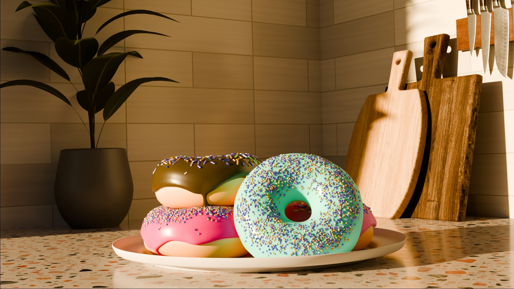

# 3D Donut & Coffee - Blender Guru Tutorial

## 🍩 About This Project

This repository contains the project files for my 3D donut and coffee scene, created by following the "Blender 4.0 Beginner Tutorial" series by **Andrew Price (Blender Guru)**.

This project is a well-known "rite of passage" for beginners in the Blender community, designed to teach the fundamentals of 3D modeling, shading, lighting, and rendering from start to finish. This is my completed version.

---

## 🛠️ Tools & Technologies Used

* **Software:** Blender (v4.0)
* **Renderer:** Cycles
* **Post-processing:** Blender Compositor

---

## 🎓 What I Learned

This tutorial was a comprehensive introduction to Blender, covering a huge range of topics. Key skills I learned include:

* **Modeling:** Basic mesh editing, proportional editing, and using modifiers (Subdivision Surface, Solidify, etc.).
* **Geometry Nodes:** Using the new node-based system to create and distribute sprinkles.
* **Shading:** Creating procedural materials (for the icing, donut, and coffee) using Blender's node-based Shader Editor.
* **UV Unwrapping:** Applying image textures to the coffee cup.
* **Lighting:** Setting up a 3-point lighting system and using an HDRI for realistic reflections.
* **Scene Composition:** Using the camera, setting depth of field, and framing the shot.
* **Rendering:** Configuring render settings in Cycles for a high-quality final image.
* **Compositing:** Using the Compositor to add finishing touches like glare and color correction.

---

## 🙏 Acknowledgments

* **Andrew Price (Blender Guru):** A massive thank you to Andrew for creating such an accessible, comprehensive, and free tutorial series.
* **Tutorial Link:** [Blender 4.0 Beginner Tutorial Playlist](https://www.youtube.com/playlist?list=PLjEaoINrYCVK_4H3jNn1s4Z98msv-B1d)
* **Blender Community:** For providing a welcoming space for beginners to learn and share their work.
